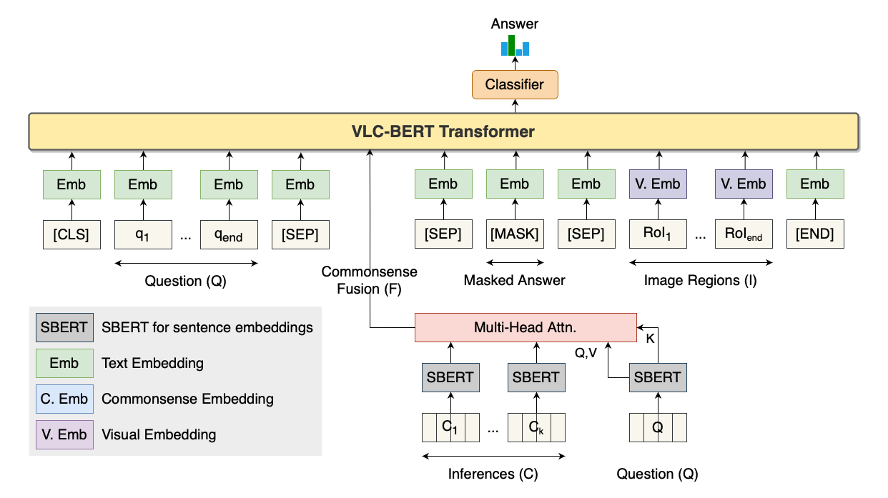

# VLC-BERT

VLC-BERT is a vision-language-commonsense transformer model that incoporates contextualized commonsense for external knowledge visual questioning tasks, OK-VQA and A-OKVQA.

*Note*: This repository has code for the VLC-BERT transformer model. For Knowledge generation and selection (generating the final commonsense inferences that go into VLC-BERT), please refer to [this project](https://github.com/sahithyaravi1493/VLC_Commonsense).



## Citing VLC-BERT

```
TODO
```

# Setup

Please follow instructions in [SETUP.md](SETUP.md) file. This file also provides links to download pretrained models.

# Train and Eval

Configuration files under the `./cfgs` folder can be edited to your needs. It is currently set up for single-GPU training on an RTX 2080Ti (12 GB memory).

To run OK-VQA training:
```
# ./scripts/dist_run_single.sh 1 okvqa/train_end2end.py cfgs/okvqa/semQO-5-weak-attn.yaml ./
```

To run A-OKVQA training:
```
./scripts/dist_run_single.sh 1 aokvqa/train_end2end.py cfgs/aokvqa/semQO-5-weak-attn.yaml ./
```
To run evaluation (example):
```
python aokvqa/test.py \
  --cfg cfgs/aokvqa/base/semQO-5-weak-attn.yaml \
  --ckpt output/vlc-bert/aokvqa/base/semQO-5-weak-attn/train2017_train/vlc-bert_base_aokvqa-latest.model \
  --split test2017 \
  --gpus 0
```

# Acknowledgement

We built VLC-BERT on top of VL-BERT: [https://github.com/jackroos/VL-BERT](https://github.com/jackroos/VL-BERT)

In addition, we would like to acknowledge that we use the following works extensively:

* [SBERT](https://www.sbert.net)
* [AllenNLP COMET](https://comet.allenai.org/model_comet2020_entities)
* [YOLOv5](https://github.com/ultralytics/yolov5)
* [Wandb](https://wandb.ai/)
